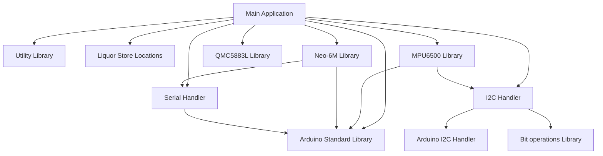

# Beer Compass

A compass built with the Arduino framework that always points to the nearest liquor store. This repository contains the firmware for version 0 of the project, which uses breakout boards and breadboards. Version 1 will feature a custom PCB design, but the firmware will remain largely the same since the same ICs will be used. (At least, that's the plan at the time of writing.)

# Project Organization

Tgus versuib us developed on an ESP32 using the Arduino framework. To enhance portability, the code is structured to separate hardware interfacing from the high level logic. Wrapper libraries handle I2C, SPI, and Serial communications. The IC libraries and main application avoid direct hardware calls, so if the project moves to another language or framework, only the hardware wrappers need modification, keeping the rest of the code untouched.

## Library Structure

